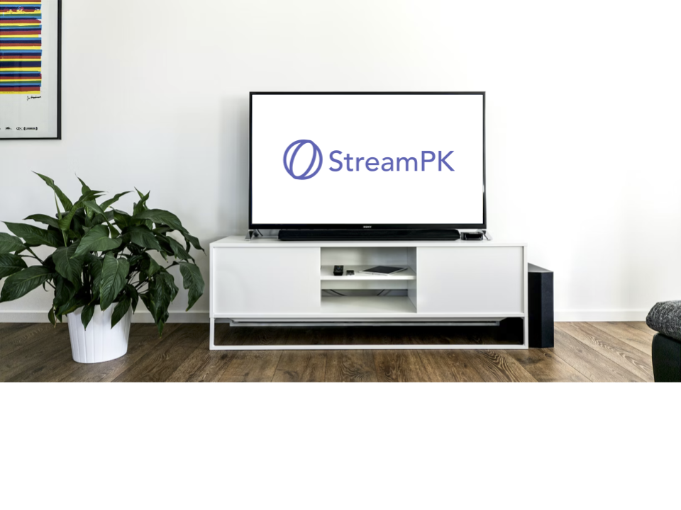

<div align="center">
  

  <h1>StreamPK Sports</h1>
  <p><strong>Watch live sports matches natively in Kodi, powered by streamed.pk</strong></p>
  
  <p>
    
    
    
  </p>
</div>

---

## Overview

StreamPK Sports is a streamlined video addon designed to fetch and stream live sports directly from the streamed.pk API. Unlike standard resolvers that struggle with modern anti-bot mechanisms, this addon utilizes an automated background extractor to pull high-quality video and audio feeds seamlessly into Kodi's native media player.

## Features

- **Live Sports Hub**: Real-time matches spanning Soccer, Motorsports, Basketball, Football, and more.
- **Today's Matches**: Quickly browse schedules and events playing today.
- **Native Playback**: The integrated background stream multiplexer flawlessly passes HLS and fMP4 video back to Kodi's internal player, preventing any need for external browser popups.
- **Automated Unmute**: Video and audio feeds are intelligently merged and started without requiring any manual interaction.

## Architecture

Modern sports streams often employ complex WebRTC or chunked fMP4 delivery that standard Kodi resolvers cannot process. StreamPK circumvents this by running a headless background proxy (`extractor_proxy.py`) powered by Playwright and FFmpeg. 

When a stream is selected:
1. The addon initiates the headless proxy in the background.
2. The proxy intercepts the raw video and audio data chunks natively.
3. FFmpeg multiplexes the separated chunks into a single `MPEG-TS` stream in real time.
4. Kodi natively plays the local endpoint (`http://127.0.0.1:8081/stream`) in high definition.

## Installation

### Prerequisites

Because this addon relies on a headless browser for extraction, ensure your host system has the following dependencies installed:

* **Python 3**
* **FFmpeg** (must be available in your system's PATH)
* **Playwright**:
  ```bash
  pip install playwright
  playwright install chromium
  ```

### Manual Install

1. Download the repository as a ZIP file.
2. Open Kodi and navigate to **Add-ons** > **Install from zip file**.
3. Select the downloaded ZIP file.
4. Wait for the installation confirmation notification.

## Troubleshooting

If you encounter issues where the stream times out or fails to load:

* **Check the Kodi Log**: Review the `kodi.log` file, typically located in `~/.kodi/temp/` on Linux systems.
* **Verify FFmpeg**: Ensure `ffmpeg` is properly installed and accessible from the command line.
* **Verify Playwright**: Ensure Playwright and its Chromium binaries are installed correctly in the same Python environment that Kodi utilizes.

---
<div align="center">
  <i>Developed by Miles Hilliard</i> | <a href="https://www.mileshilliard.com">Website</a>
</div>
